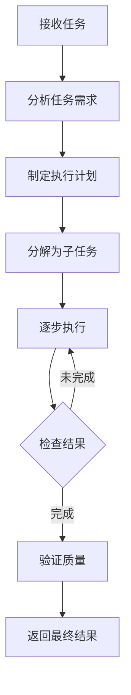

# 大模型系列——智能Agent简介

智能 Agent（智能代理）代表了人工智能发展的一个重要方向。它不仅能够理解自然语言，更重要的是能够自主感知环境、做出决策并执行行动以实现特定目标。随着大语言模型能力的不断提升，智能 Agent 已经成为 AI 领域最热门的研究方向之一。

> 💡 **核心概念**: 智能 Agent 就像是一个虚拟的"智能助手"，它能够理解你的需求，自主规划和执行任务，而不需要你逐步指导每一步操作。

## 🤖 什么是智能 Agent？

### 基本定义

智能 Agent 是指能够自主感知环境、做出决策并执行行动以实现特定目标的 AI 系统。它具备以下关键特征：

- **感知能力**: 能够感知和理解环境信息
- **决策能力**: 基于感知信息做出合理的决策
- **执行能力**: 能够执行决策产生的行动
- **学习能力**: 能够从经验中学习和改进
- **自主性**: 能够独立运作，无需持续人工干预

### 与传统 AI 的区别

| 特性 | 传统 AI | 智能 Agent |
|------|---------|------------|
| 交互方式 | 一次性问答 | 多轮对话与执行 |
| 工作模式 | 被动响应 | 主动规划和执行 |
| 目标导向 | 回答问题 | 完成任务 |
| 复杂度 | 单步处理 | 多步骤推理和执行 |
| 环境交互 | 有限 | 持续感知和适应 |

### 发展历程

::::note[AI 发展的三个阶段]
1. **感知阶段**: AI 主要解决"感知"问题，如图像识别、语音识别
2. **认知阶段**: AI 发展到能够"理解"和"生成"，如大语言模型
3. **执行阶段**: AI 开始能够"行动"，这就是智能 Agent 时代的开始
::::

## 🎯 智能 Agent 的核心特性

### 1. 自主性 (Autonomy)

智能 Agent 能够独立做出决策，无需持续的人工干预。它可以根据环境变化自主调整策略：

```python
# 伪代码示例：自主决策过程
class IntelligentAgent:
    def make_decision(self, observation):
        # 1. 分析当前环境状态
        context = self.analyze_environment(observation)
        
        # 2. 评估可能的行动方案
        options = self.generate_options(context)
        
        # 3. 选择最佳行动
        best_action = self.select_best_action(options)
        
        # 4. 执行行动并观察结果
        result = self.execute_action(best_action)
        
        # 5. 从结果中学习
        self.learn_from_result(result)
        
        return best_action
```

### 2. 适应性 (Adaptability)

Agent 能够根据环境变化调整自己的行为策略，适应不同的场景和需求：

:::tip[适应性示例]
当一个智能客服 Agent 遇到新的问题时，它能够：
- 尝试基于已有知识回答
- 如果不确定，主动搜索相关信息
- 从用户的反馈中学习
- 更新自己的知识库
:::

### 3. 目标导向 (Goal-Oriented)

Agent 的所有行为都围绕特定目标或任务进行规划和执行：

::::important[目标导向的体现]
- **明确目标**: 清晰知道要完成什么任务
- **任务分解**: 将复杂目标分解为可执行的子任务
- **进度跟踪**: 持续监控任务完成进度
- **结果验证**: 确保任务结果符合预期
::::

### 4. 多步骤推理 (Multi-step Reasoning)

Agent 能够进行复杂的推理和规划，执行需要多个步骤才能完成的任务：



## 🌐 智能 Agent 的应用场景

### 1. 个人智能助手

:::tip[应用案例]
- **日程管理**: 自动安排会议、提醒重要事件
- **信息查询**: 快速查找并总结相关信息
- **任务规划**: 帮助制定旅行计划、学习计划等
- **生活建议**: 基于个人喜好提供个性化建议
:::

### 2. 智能客户服务

智能 Agent 在客服领域的应用已经相当成熟：

- **自动问答**: 回答常见问题，减轻人工客服压力
- **问题分类**: 自动识别问题类型并转接到相应部门
- **情感识别**: 理解客户情绪，提供更有针对性的服务
- **多轮对话**: 处理复杂的客户问题和需求

```javascript
// 智能客服 Agent 工作流程示例
const customerServiceAgent = {
  async handleCustomerQuery(query) {
    // 1. 分析查询意图
    const intent = await this.analyzeIntent(query);
    
    // 2. 检查知识库
    const knowledge = await this.searchKnowledgeBase(intent);
    
    // 3. 如果知识库中有答案，直接返回
    if (knowledge) {
      return knowledge.answer;
    }
    
    // 4. 如果知识库中没有，进行推理回答
    const answer = await this.generateAnswer(query, intent);
    
    // 5. 将新问题和答案存入知识库
    await this.updateKnowledgeBase(query, answer);
    
    return answer;
  }
};
```

### 3. 自动化数据分析

:::important[数据分析 Agent 的能力]
- **数据收集**: 自动从多个数据源收集数据
- **数据清洗**: 处理缺失值、异常值和重复数据
- **特征工程**: 自动提取和构造有意义的特征
- **模型训练**: 自动选择和训练合适的机器学习模型
- **结果解释**: 自动生成分析报告和可视化图表
:::

### 4. 科研辅助 Agent

科研 Agent 可以显著提升研究效率：

- **文献检索**: 快速查找相关研究论文
- **实验设计**: 辅助设计实验方案和参数
- **数据分析**: 协助分析实验数据
- **论文撰写**: 辅助撰写研究论文
- **同行评审**: 模拟同行评审过程

:::warning[注意事项]
虽然科研 Agent 可以提供很大帮助，但最终的研究结论和论文质量仍需要研究者亲自把控和验证。
:::

### 5. 自动化工作流

Agent 可以连接和协调多个系统完成复杂任务：

```yaml
# 示例：自动化订单处理工作流
order_processing_agent:
  steps:
    - name: 接收订单
      action: parse_order
    - name: 库存检查
      action: check_inventory
      condition: "库存充足"
    - name: 支付处理
      action: process_payment
    - name: 物流安排
      action: arrange_shipping
    - name: 通知客户
      action: notify_customer
  fallback:
    - name: 库存不足处理
      action: handle_low_stock
    - name: 支付失败处理
      action: handle_payment_failure
```

## 🧠 智能 Agent 的技术架构

### 核心组件

一个典型的智能 Agent 包含以下核心组件：

```
┌─────────────────────────────────────────┐
│          智能 Agent 架构                │
├─────────────────────────────────────────┤
│  ┌─────────────┐  ┌─────────────────┐  │
│  │  感知模块   │  │   决策模块      │  │
│  │  Perception │  │  Decision Making│  │
│  └──────┬──────┘  └────────┬────────┘  │
│         │                  │           │
│         ▼                  ▼           │
│  ┌─────────────┐  ┌─────────────────┐  │
│  │  记忆模块   │  │   执行模块      │  │
│  │   Memory    │  │  Action Execution│  │
│  └─────────────┘  └─────────────────┘  │
│         │                  │           │
│         └─────────┬────────┘           │
│                   ▼                    │
│          ┌───────────────┐            │
│          │  学习模块     │            │
│          │    Learning   │            │
│          └───────────────┘            │
└─────────────────────────────────────────┘
```

### 感知模块

负责从环境中获取信息并进行处理：

- **多模态输入**: 支持文本、图像、音频等多种输入方式
- **信息理解**: 将原始信息转换为可理解的结构化数据
- **情境感知**: 理解当前环境的状态和上下文

### 决策模块

基于感知到的信息做出合理的决策：

- **推理能力**: 进行逻辑推理和常识推理
- **规划能力**: 制定完成任务的最佳策略
- **决策算法**: 使用各种算法选择最优行动

### 记忆模块

存储和管理 Agent 的经验和知识：

- **短期记忆**: 存储当前的对话上下文
- **长期记忆**: 存储长期的知识和经验
- **知识库**: 结构化存储领域知识

### 执行模块

执行决策产生的行动：

- **工具调用**: 调用各种外部工具和服务
- **API 集成**: 与其他系统进行交互
- **结果反馈**: 将执行结果反馈给决策模块

### 学习模块

从经验中学习并持续改进：

- **强化学习**: 从奖励和惩罚中学习
- **监督学习**: 从标注数据中学习
- **自监督学习**: 从无标签数据中学习

## 🚀 未来发展趋势

:::important[未来方向]
智能 Agent 的发展将朝着以下几个方向演进：

1. **更强的推理能力**: 具备更复杂的逻辑推理和常识推理能力
2. **多模态融合**: 同时处理文本、图像、音频、视频等多种模态
3. **协作能力**: 多个 Agent 协同工作，完成更复杂的任务
4. **个性化定制**: 根据用户特点进行个性化定制
5. **安全可控**: 确保 Agent 的行为安全、可控、可解释
:::

### 多智能体协作

未来，多个智能 Agent 将能够协同工作：

```python
# 多智能体协作示例
class MultiAgentSystem:
    def __init__(self):
        self.agents = {
            'researcher': ResearchAgent(),
            'writer': WriterAgent(),
            'reviewer': ReviewerAgent()
        }
    
    async def complete_task(self, task):
        # 研究者 Agent 收集信息
        research = await self.agents['researcher'].research(task)
        
        # 写作者 Agent 基于研究结果生成内容
        content = await self.agents['writer'].write(research)
        
        # 审阅者 Agent 检查内容质量
        review = await self.agents['reviewer'].review(content)
        
        return review.final_content
```

## 📚 学习资源与工具

### 开源框架

- **LangChain**: 构建 LLM 应用的强大框架
- **AutoGPT**: 自动化 GPT 的先驱项目
- **BabyAGI**: 任务管理和执行的智能系统
- **CrewAI**: 多智能体协作框架

### 实践建议

:::tip[学习路径]
1. **基础**: 先学习基本的编程和大语言模型知识
2. **工具**: 掌握 LangChain 等开发框架
3. **实践**: 从简单的任务开始，逐步增加复杂度
4. **深入**: 学习 Agent 的原理和优化方法
5. **创新**: 尝试创建自己的智能 Agent
:::

:::caution[注意事项]
- 智能 Agent 仍在发展阶段，存在一定的局限性
- 需要持续监控和优化 Agent 的行为
- 注意保护用户隐私和数据安全
- 建立适当的约束和监督机制
:::

## 🎯 总结

智能 Agent 代表了人工智能发展的新阶段。它不仅是技术的进步，更是人类与 AI 交互方式的革新。通过赋予 AI 自主感知、决策和执行的能力，我们可以让 AI 成为我们更强大的助手。

随着技术的不断发展，智能 Agent 将在更多领域发挥重要作用，为我们的工作和生活带来更多便利和效率。未来已来，让我们一起拥抱这个智能代理的新时代！

> 🚀 **下一步**: 了解如何使用 LangChain 构建你的第一个智能 Agent，以及如何在实际项目中应用这些概念。
