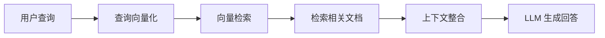

# 大模型系列——解读RAG

检索增强生成 (Retrieval-Augmented Generation, 简称 RAG) 是一种结合了信息检索和生成式AI的革命性技术。它旨在解决大型语言模型面临的知识时效性、幻觉和专业领域知识不足等核心问题，为AI应用带来了全新的可能。

> 💡 **核心概念**: RAG 就像是给大语言模型配备了一个"外挂知识库"，让它能够在需要时随时查阅参考资料，就像学生参加"开卷考试"一样。

## 🔍 什么是 RAG？

### 基本定义

RAG 是一种创新的技术范式，它巧妙地将大语言模型的"参数化知识"（模型内部固化的知识）与"非参数化知识"（外部知识库中的知识）相结合。在生成回答之前，RAG 系统会先从外部知识库中检索相关信息，然后将这些信息作为上下文提供给大语言模型，从而显著提升生成内容的准确性和可靠性。

:::note[传统 vs RAG]
- **传统 LLM**: 闭卷考试，只能依靠训练时学到的知识
- **RAG 系统**: 开卷考试，可以随时查阅外部资料
:::

### 核心价值

RAG 技术解决了大语言模型面临的多个关键挑战：

| 挑战 | 传统 LLM 的局限 | RAG 的解决方案 |
|------|----------------|----------------|
| **知识时效性** | 模型知识截止于训练时间 | 实时检索最新信息 |
| **幻觉问题** | 可能生成不准确的内容 | 基于检索内容生成 |
| **领域专业性** | 缺乏特定领域知识 | 引入专业知识库 |
| **可追溯性** | 难以验证答案来源 | 提供参考来源 |

### 工作原理

RAG 的工作流程包含四个核心步骤：



## 🏗️ RAG 的技术架构

### 1. 文档处理与向量化

#### 文档分块策略

将文档分割成适当大小的片段是 RAG 成功的关键：

```python
from langchain.text_splitter import RecursiveCharacterTextSplitter

# 使用递归字符分割器
text_splitter = RecursiveCharacterTextSplitter(
    chunk_size=1000,           # 每个片段的字符数
    chunk_overlap=200,         # 片段之间的重叠字符数
    length_function=len,       # 计算长度的函数
    separators=["\n\n", "\n", "。", "！", "？", " ", ""]  # 分隔符
)

# 分割文档
chunks = text_splitter.split_documents(documents)
```

:::tip[分块策略选择]
- **固定长度**: 简单直接，但可能破坏语义边界
- **语义分割**: 保持语义完整性，效果更好但计算复杂
- **段落分割**: 适用于结构化文档，如学术论文
:::

#### 向量化处理

使用嵌入模型将文本转换为向量表示：

```python
from langchain.embeddings import HuggingFaceEmbeddings

# 选择合适的嵌入模型
embeddings = HuggingFaceEmbeddings(
    model_name="moka-ai/m3e-base",  # 中文优化的嵌入模型
    model_kwargs={'device': 'cuda'},  # 使用 GPU 加速
    encode_kwargs={'normalize_embeddings': True}  # 归一化嵌入
)

# 将文档片段向量化
vector_store = Chroma.from_documents(
    chunks,
    embeddings,
    persist_directory="./chroma_db"
)
```

### 2. 向量数据库

#### 主流选择

| 数据库 | 特点 | 适用场景 |
|--------|------|----------|
| **Pinecone** | 托管服务，易用 | 企业应用，快速部署 |
| **Milvus** | 开源，功能丰富 | 大规模部署，自定义需求 |
| **Chroma** | 轻量级，易集成 | 个人项目，快速原型 |
| **FAISS** | 高性能，Facebook出品 | 大规模检索场景 |

#### Chroma 实战示例

```python
import chromadb
from chromadb.config import Settings

# 创建 Chroma 客户端
client = chromadb.Client(Settings(
    chroma_db_impl="duckdb+parquet",
    persist_directory="./chroma_db"
))

# 创建集合
collection = client.create_collection(
    name="knowledge_base",
    metadata={"hnsw:space": "cosine"}  # 使用余弦相似度
)

# 添加文档
collection.add(
    documents=chunks,
    embeddings=embeddings,
    metadatas=[{"source": doc.metadata.get("source")} for doc in chunks],
    ids=[f"doc_{i}" for i in range(len(chunks))]
)

# 检索相关文档
results = collection.query(
    query_texts=[query],
    n_results=3,  # 返回最相关的 3 个文档
    include=["documents", "metadatas", "distances"]
)
```

### 3. 查询处理

#### 查询重写优化

为了提高检索质量，可以对用户查询进行重写：

```python
from langchain.chains import LLMChain
from langchain.prompts import PromptTemplate

# 查询重写模板
rewrite_template = """
你是一个专业的查询重写助手。请将用户的查询重写为更清晰的检索查询。

原查询：{query}

重写查询：只返回重写后的查询，不要其他内容。
"""

rewrite_prompt = PromptTemplate(
    input_variables=["query"],
    template=rewrite_template
)

# 创建查询重写链
rewrite_chain = LLMChain(
    llm=ChatOpenAI(model="gpt-3.5-turbo"),
    prompt=rewrite_prompt
)

# 重写查询
rewritten_query = rewrite_chain.run(query)
```

:::important[查询优化技巧]
- **同义词扩展**: 添加相关的同义词和近义词
- **意图识别**: 理解用户的真实意图
- **上下文补全**: 在多轮对话中补充上下文信息
:::

### 4. 上下文增强生成

#### Prompt 工程设计

设计有效的 Prompt 是 RAG 成功的关键：

```python
from langchain.prompts import PromptTemplate

# RAG 专用 Prompt 模板
rag_template = """
你是一个专业的问答助手。请基于以下参考资料回答用户的问题。

参考资料：
{context}

用户问题：
{question}

回答要求：
1. 基于参考资料回答，不要编造信息
2. 如果参考资料中没有相关信息，明确说明
3. 保持回答的准确性和可靠性
4. 必要时可以引用参考资料的具体内容

回答：
"""

rag_prompt = PromptTemplate(
    input_variables=["context", "question"],
    template=rag_template
)
```

#### 结果重排序

对初始检索结果进行重排序，提高相关性：

```python
from sentence_transformers import CrossEncoder

# 加载重排序模型
reranker = CrossEncoder('BAAI/bge-reranker-base')

# 重排序函数
def rerank_results(query, documents, top_k=3):
    # 计算查询与每个文档的相关性得分
    scores = reranker.predict(
        [(query, doc.page_content) for doc in documents]
    )
    
    # 按得分排序
    ranked_docs = sorted(
        zip(documents, scores),
        key=lambda x: x[1],
        reverse=True
    )
    
    # 返回前 top_k 个文档
    return [doc for doc, score in ranked_docs[:top_k]]

# 对检索结果进行重排序
reranked_docs = rerank_results(query, retrieved_docs)
```

## 🎯 RAG 的实际应用场景

### 1. 企业知识库问答

:::important[应用价值]
将企业内部文档、手册、知识库整合到 RAG 系统中，为员工提供准确的内部知识问答服务。

**主要优势：**
- 整合分散的知识资源
- 提供快速准确的信息检索
- 降低信息获取成本
- 提高工作效率
:::

### 2. 智能客服系统

结合企业产品信息、常见问题和历史对话，构建更智能、更准确的客服系统：

```python
# 智能客服 RAG 系统
class CustomerServiceRAG:
    def __init__(self):
        self.product_knowledge = self.load_product_docs()
        self.faq_knowledge = self.load_faq_docs()
        self.chat_history = []
    
    def answer_customer_query(self, query):
        # 1. 检索相关产品信息
        product_info = self.retrieve_from_kb(
            query, 
            self.product_knowledge
        )
        
        # 2. 检索相关 FAQ
        faq_info = self.retrieve_from_kb(
            query, 
            self.faq_knowledge
        )
        
        # 3. 获取对话上下文
        context = self.get_conversation_context()
        
        # 4. 整合信息生成回答
        response = self.generate_response(
            query, 
            product_info, 
            faq_info, 
            context
        )
        
        # 5. 更新对话历史
        self.chat_history.append((query, response))
        
        return response
```

### 3. 学术研究助手

帮助研究人员快速检索相关文献，生成文献综述：

:::tip[研究助手功能]
- **文献检索**: 基于论文摘要和内容进行语义检索
- **文献总结**: 自动生成论文要点总结
- **关联发现**: 发现相关研究领域的论文
- **引用分析**: 分析论文的引用关系
:::

### 4. 个性化教育辅导

根据特定的教材和学习资料，为学生提供个性化的学习辅导和答疑服务：

```python
class EducationRAG:
    def __init__(self, course_materials):
        self.knowledge_base = self.build_course_kb(course_materials)
        self.student_profiles = {}
    
    def provide_personalized_help(self, student_id, question):
        # 获取学生信息和学习进度
        student_info = self.student_profiles[student_id]
        
        # 检索相关知识点
        relevant_concepts = self.retrieve_concepts(
            question,
            student_info.current_topics
        )
        
        # 检索相关例题
        similar_problems = self.retrieve_problems(
            question,
            student_info.learning_history
        )
        
        # 生成个性化解答
        answer = self.generate_explanation(
            question,
            relevant_concepts,
            similar_problems,
            student_info.learning_level
        )
        
        return answer
```

## 🚀 RAG 系统的优化策略

### 混合检索

结合关键词检索和向量检索，提高检索质量：

```python
from langchain.retrievers import BM25Retriever
from langchain.retrievers import EnsembleRetriever

# BM25 关键词检索器
bm25_retriever = BM25Retriever.from_documents(chunks)
bm25_retriever.k = 5

# 向量检索器
vector_retriever = vector_store.as_retriever(
    search_kwargs={"k": 5}
)

# 集成检索器（混合检索）
ensemble_retriever = EnsembleRetriever(
    retrievers=[bm25_retriever, vector_retriever],
    weights=[0.3, 0.7]  # BM25 权重 0.3，向量检索权重 0.7
)
```

### 自适应检索

根据用户反馈动态调整检索策略：

:::warning[注意事项]
自适应检索需要收集用户反馈数据，因此要注意隐私保护和数据合规性。
:::

### 多模态增强

整合文本、图像等多种模态信息：

```python
from PIL import Image
import base64

def encode_image(image_path):
    with open(image_path, "rb") as image_file:
        return base64.b64encode(image_file.read()).decode('utf-8')

# 多模态 RAG 查询
query_with_image = {
    "text": "描述这张图片中的内容",
    "image": encode_image("example.jpg")
}

# 使用支持多模态的模型
response = multimodal_rag_system.query(query_with_image)
```

## 📊 评估与监控

### 评估指标

| 指标 | 说明 | 评估方法 |
|------|------|----------|
| **检索准确率** | 检索结果的相关性 | 人工标注评估 |
| **回答质量** | 生成回答的准确性 | 问答匹配评估 |
| **响应速度** | 系统响应时间 | 性能监控 |
| **用户满意度** | 用户对回答的满意度 | 用户反馈 |

### 持续优化

:::important[优化循环]
1. **收集数据**: 记录查询、检索结果、用户反馈
2. **分析问题**: 识别系统瓶颈和不足
3. **优化策略**: 调整算法和参数
4. **验证效果**: 评估优化效果
5. **持续迭代**: 重复上述过程
:::

## 🔮 未来发展趋势

### 多模态 RAG

将文本、图像、音频、视频等多种模态的信息整合到 RAG 系统中：

- **图文结合**: 理解图像内容和文本描述
- **音频处理**: 处理语音查询和音频内容
- **视频理解**: 理解视频内容和场景

### 实时知识更新

支持对动态变化的数据源进行实时索引和检索：

```python
class RealTimeRAG:
    def __init__(self):
        self.knowledge_base = KnowledgeBase()
        self.update_scheduler = UpdateScheduler()
    
    def start_real_time_updates(self, data_sources):
        # 设置数据源监控
        for source in data_sources:
            self.update_scheduler.watch(source)
    
    def on_data_change(self, source, new_data):
        # 实时更新知识库
        self.knowledge_base.update(
            source=source,
            data=new_data
        )
        # 重建索引
        self.knowledge_base.rebuild_index()
```

### 个性化 RAG

根据用户的个性化需求和偏好，动态调整检索策略和生成风格：

```python
class PersonalizedRAG:
    def __init__(self):
        self.user_profiles = {}
        self.personalization_models = {}
    
    def get_personalized_answer(self, user_id, query):
        # 获取用户画像
        profile = self.user_profiles[user_id]
        
        # 应用个性化检索策略
        personalization = self.personalization_models[user_id]
        
        # 检索相关内容
        relevant_docs = self.retrieve_with_personalization(
            query, 
            profile, 
            personalization
        )
        
        # 生成个性化回答
        answer = self.generate_personalized_response(
            query, 
            relevant_docs, 
            profile.preferences
        )
        
        return answer
```

## 📚 总结

RAG 技术作为连接大语言模型与外部知识库的桥梁，为解决 LLM 的知识局限性问题提供了一种优雅且高效的解决方案。它通过将模型内部的参数化知识与外部的非参数化知识相结合，显著提升了模型输出的准确性、时效性和可信度。

随着技术的不断发展，RAG 系统将在更多领域得到应用，并朝着更加智能化、高效化和个性化的方向发展。对于企业和开发者来说，掌握 RAG 技术将成为构建下一代智能应用的重要基础能力。

> 🚀 **下一步**: 
> - 学习 RAG 入门与技术演进
> - 实践构建你自己的 RAG 系统
> - 探索 RAG 在特定领域的应用
