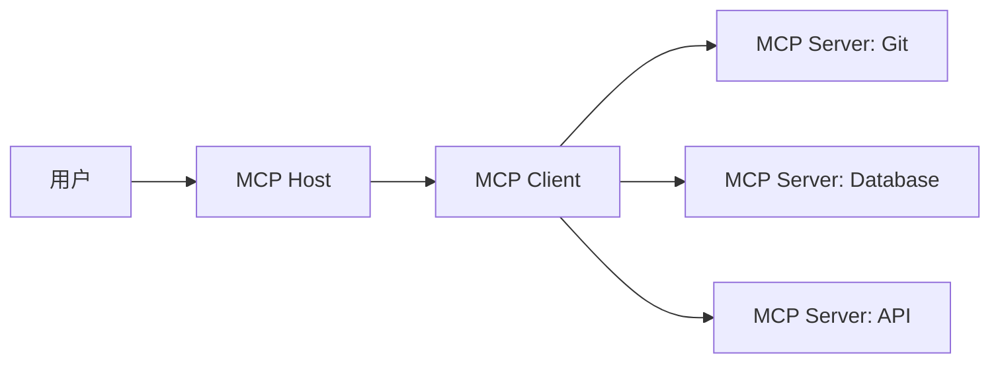

# 大模型系列——从VM隔离到多Agent协作：Claude Cowork与WorkBuddy技术架构深度解析

2026年1月，Anthropic发布Claude Cowork，标志着AI Agent从"开发者工具"向"通用生产力工具"的演进。随后，腾讯云推出WorkBuddy，基于端侧AI的架构实现了多Agent并行协作。两款产品虽然定位相似，但技术路径截然不同，代表了AI Agent系统的两种主流架构范式。

本文将深度拆解两者的技术架构，对比VM隔离与端侧执行、MCP协议与多Agent通信，探讨如何构建安全、高效、可扩展的AI Agent系统。

## 🏗️ 架构范式对比

| 维度 | Claude Cowork | WorkBuddy |
|------|---------------|-----------|
| **隔离方案** | VM硬件级隔离 | 端侧AI本地执行 |
| **执行环境** | Linux虚拟机 | 原生操作系统 |
| **通信协议** | MCP（Model Context Protocol） | 基于消息的Mailbox系统 |
| **多Agent模式** | 子代理（Sub-agents） | Agent Teams并行协作 |
| **安全模型** | 沙盒化 + 最小权限 | 用户控制 + 审计日志 |
| **扩展机制** | MCP Server插件 | 技能包（Skills） |
| **适用场景** | 企业级安全要求高 | 个人桌面效率工具 |

## 🔒 Claude Cowork：VM隔离的沙盒架构

### 核心设计理念

Claude Cowork的核心设计理念是**安全可控的执行环境**，通过VM隔离确保Agent行为完全可预测、可审计、可撤销。

### VM隔离实现

**技术基础**

Claude Cowork在macOS上使用Apple Virtualization Framework（AVF）创建轻量级Linux虚拟机：

```python
# 伪代码：VM创建流程
class CoworkVM:
    def __init__(self):
        self.vf = VirtualizationFramework()
        self.vm = self.vf.create_vm(
            os="Linux",
            memory="4GB",
            cpu="4 vCPUs",
            storage="10GB"
        )
        
        # 预装工具链
        self.setup_environment([
            "git", "grep", "curl", "python3",
            "node", "docker", "vim"
        ])
    
    def execute(self, command):
        """在隔离环境中执行命令"""
        return self.vm.run(command, timeout=300)
```

**安全边界**

VM隔离提供三层安全保护：

1. **进程隔离**：Agent进程在VM内运行，无法直接访问宿主机进程
2. **文件系统隔离**：默认无文件访问权限，需用户显式挂载
3. **网络隔离**：可配置网络策略，限制外部访问

**文件共享机制**

通过受控的文件挂载实现最小权限原则：

```bash
# 用户显式授权
cowork mount --path ~/Projects --read-write
cowork mount --path ~/.ssh --read-only

# VM内部挂载点
/mnt/projects/    # 读写权限
/mnt/ssh/         # 只读权限
```

**攻击场景防护**

```python
# 恶意命令示例
command = "rm -rf /"

# VM内执行：仅删除VM内文件，宿主机不受影响
vm.execute(command)
# ✅ 结果：VM重建，宿主机安全
```

### MCP协议架构

MCP（Model Context Protocol）是Claude Cowork的核心通信协议，解决工具集成的标准化问题。

**协议角色**



**核心原语**

MCP定义三种核心原语：

**1. Resources（资源）**
```typescript
// 只读数据源定义
interface Resource {
  uri: string;           // 资源URI
  name: string;          // 资源名称
  description: string;   // 资源描述
  mimeType?: string;     // MIME类型
}

// 示例：数据库Schema资源
const databaseSchema: Resource = {
  uri: "db://schema/main",
  name: "Main Database Schema",
  description: "包含用户表、订单表、产品表的完整Schema",
  mimeType: "application/sql"
};
```

**2. Tools（工具）**
```typescript
// 可执行函数定义
interface Tool {
  name: string;          // 工具名称
  description: string;   // 工具描述
  inputSchema: JSONSchema; // 输入参数Schema
}

// 示例：SQL查询工具
const executeSQL: Tool = {
  name: "execute_sql",
  description: "在数据库中执行SQL查询",
  inputSchema: {
    type: "object",
    properties: {
      query: {
        type: "string",
        description: "要执行的SQL语句"
      }
    },
    required: ["query"]
  }
};
```

**3. Prompts（提示词模板）**
```typescript
// 预定义工作流模板
interface Prompt {
  name: string;          // 模板名称
  description: string;   // 模板描述
  template: string;      // 提示词模板
}

// 示例：代码审查工作流
const codeReviewPrompt: Prompt = {
  name: "code_review",
  description: "标准的代码审查流程",
  template: `
    请审查以下代码：
    1. 检查安全性问题
    2. 评估性能瓶颈
    3. 代码风格一致性
    4. 测试覆盖率
    
    代码：{{code}}
  `
};
```

**传输层**

MCP支持两种传输模式：

```python
# Stdio模式：本地进程间通信
class StdioTransport:
    def __init__(self, server_command):
        self.process = subprocess.Popen(
            server_command,
            stdin=subprocess.PIPE,
            stdout=subprocess.PIPE,
            stderr=subprocess.PIPE
        )
    
    def send(self, message):
        """发送消息到Server"""
        self.process.stdin.write(json.dumps(message))
        self.process.stdin.flush()
    
    def receive(self):
        """接收Server响应"""
        line = self.process.stdout.readline()
        return json.loads(line)

# Streamable HTTP：远程多租户访问
class HTTPTransport:
    def __init__(self, endpoint, api_key):
        self.endpoint = endpoint
        self.headers = {"Authorization": f"Bearer {api_key}"}
    
    def send(self, message):
        """通过HTTP发送消息"""
        response = requests.post(
            self.endpoint,
            json=message,
            headers=self.headers,
            stream=True
        )
        return response.json()
```

### Agentic循环设计

Claude Cowork通过Agentic循环实现任务的自主执行和闭环处理。

**循环流程**

```python
class AgenticLoop:
    def execute_task(self, task):
        while not task.completed:
            # 1. 感知（Observation）
            observation = self.observe_environment()
            
            # 2. 规划（Planning）
            plan = self.generate_plan(observation, task)
            self.show_plan_to_user(plan)  # 用户可查看和调整
            
            # 3. 行动（Action）
            action = self.plan_to_action(plan)
            
            # 4. 执行（Execution）
            result = self.execute_action(action)
            
            # 5. 反思（Reflection）
            if self.needs_correction(result):
                action = self.correct_action(result)
                result = self.execute_action(action)
            
            task.progress += 1
```

**Human-in-the-Loop机制**

```python
class HumanInLoop:
    def __init__(self):
        self.dangerous_operations = {
            "delete_file",
            "drop_table",
            "rm -rf"
        }
    
    def require_approval(self, operation):
        """关键操作需用户确认"""
        if operation.type in self.dangerous_operations:
            response = self.prompt_user(
                f"即将执行危险操作: {operation}\n"
                f"是否继续？[y/N]"
            )
            return response == "y"
        return True
    
    def execute_with_approval(self, operation):
        if self.require_approval(operation):
            return operation.execute()
        else:
            return OperationCancelled()
```

## 🚀 WorkBuddy：端侧AI的多Agent协作架构

### 核心设计理念

WorkBuddy基于端侧AI的架构，强调**本地执行、并行协作、高效调度**，适合个人和团队办公场景。

### 端侧AI执行环境

**本地模型部署**

WorkBuddy在本地运行轻量化大模型：

```python
class LocalModelInference:
    def __init__(self, model_path):
        # 加载量化模型（4-bit INT8）
        self.model = AutoModelForCausalLM.from_pretrained(
            model_path,
            quantization_config=BitsAndBytesConfig(
                load_in_4bit=True,
                bnb_4bit_compute_dtype=torch.float16
            )
        )
        
        # 优化推理性能
        self.pipeline = pipeline(
            "text-generation",
            model=self.model,
            tokenizer=self.tokenizer,
            max_new_tokens=2048,
            temperature=0.7
        )
    
    def generate(self, prompt):
        """本地推理"""
        result = self.pipeline(prompt)
        return result[0]["generated_text"]
```

**性能优化**

```python
class ModelOptimizer:
    @staticmethod
    def optimize_inference(model):
        # 1. KV Cache优化
        model.config.use_cache = True
        
        # 2. Flash Attention
        model = replace_with_flash_attn(model)
        
        # 3. 动态批处理
        model.enable_dynamic_batching()
        
        # 4. 量化
        model = quantize(model, bits=4)
        
        return model
```

### Agent Teams架构

WorkBuddy的Agent Teams实现了真正的多Agent并行协作。

**团队角色**

```python
class TeamMember:
    def __init__(self, name, role, model):
        self.name = name
        self.role = role  # "researcher", "coder", "tester", etc.
        self.model = model
        self.mailbox = Mailbox()
        self.context = ConversationContext()
    
    def receive_message(self, message):
        """接收来自其他成员的消息"""
        self.mailbox.inbox.append(message)
    
    def process_messages(self):
        """处理收到的消息"""
        for message in self.mailbox.inbox:
            response = self.model.generate(
                f"收到{message.sender}的消息：{message.content}\n"
                f"你的角色是{self.role}，请回复。"
            )
            self.mailbox.send(message.sender, response)
```

**Team Leader协调**

```python
class TeamLeader:
    def __init__(self, task_description):
        self.members = []
        self.task_list = TaskList()
        self.task_description = task_description
    
    def create_team(self, roles):
        """创建团队成员"""
        for role in roles:
            member = TeamMember(
                name=f"{role}_{uuid4().hex[:8]}",
                role=role,
                model=self.load_model_for_role(role)
            )
            self.members.append(member)
    
    def decompose_task(self, task):
        """任务分解"""
        subtasks = self.model.generate(
            f"将任务分解为多个子任务：{task}\n"
            f"考虑{[m.role for m in self.members]}的角色分工。"
        )
        return self.parse_subtasks(subtasks)
    
    def assign_tasks(self):
        """分配任务"""
        for task in self.task_list.pending_tasks:
            suitable_member = self.find_member_for_task(task)
            suitable_member.assign(task)
            task.status = "assigned"
```

**共享任务列表**

```python
class TaskList:
    def __init__(self):
        self.tasks = []
        self.lock = threading.Lock()
    
    def add_task(self, task, dependencies=None):
        """添加任务（支持依赖）"""
        with self.lock:
            task = Task(
                id=uuid4(),
                description=task,
                dependencies=dependencies or [],
                status="pending"
            )
            self.tasks.append(task)
    
    def get_ready_tasks(self):
        """获取可执行的任务（依赖已满足）"""
        with self.lock:
            return [
                t for t in self.tasks
                if t.status == "pending" and
                   all(dep.status == "completed" for dep in t.dependencies)
            ]
    
    def update_status(self, task_id, status):
        """更新任务状态"""
        with self.lock:
            task = self.find_task(task_id)
            task.status = status
            
            # 触发下游任务
            if status == "completed":
                self.notify_dependent_tasks(task)
```

**消息通信机制**

```python
class Mailbox:
    def __init__(self):
        self.inbox = []
        self.sent = []
        self.lock = threading.Lock()
    
    def send(self, recipient, content):
        """发送消息"""
        message = Message(
            sender=self.owner,
            recipient=recipient,
            content=content,
            timestamp=datetime.now()
        )
        recipient.receive_message(message)
        self.sent.append(message)
    
    def broadcast(self, content):
        """广播消息（谨慎使用）"""
        for member in self.team.members:
            if member != self.owner:
                self.send(member, content)
```

### 技能包扩展机制

WorkBuddy通过技能包（Skills）扩展Agent能力。

**技能包定义**

```yaml
# skills/code_review.yaml
name: "code_review"
description: "代码审查技能"
version: "1.0.0"

tools:
  - name: "analyze_code"
    description: "分析代码质量和安全性"
    params:
      - name: "file_path"
        type: "string"
        required: true

  - name: "suggest_improvements"
    description: "提供代码优化建议"
    params:
      - name: "code_snippet"
        type: "string"
        required: true

prompts:
  - name: "review_workflow"
    template: |
      请按照以下流程审查代码：
      1. 检查安全性漏洞
      2. 评估性能瓶颈
      3. 检查代码风格
      4. 提供改进建议
      
      代码：{{code}}
```

**技能包加载**

```python
class SkillLoader:
    def __init__(self, skills_dir):
        self.skills_dir = skills_dir
        self.loaded_skills = {}
    
    def load_skill(self, skill_name):
        """加载技能包"""
        skill_path = os.path.join(self.skills_dir, f"{skill_name}.yaml")
        with open(skill_path) as f:
            skill_config = yaml.safe_load(f)
        
        # 注册工具
        for tool in skill_config["tools"]:
            self.register_tool(tool)
        
        # 注册提示词模板
        for prompt in skill_config["prompts"]:
            self.register_prompt(prompt)
        
        self.loaded_skills[skill_name] = skill_config
```

## 🔍 架构对比分析

### 安全模型对比

**Claude Cowork的沙盒化安全**

```python
# 多层安全防护
class CoworkSecurity:
    def __init__(self):
        self.vm_isolation = True      # VM隔离
        self.file_mount_control = True # 文件挂载控制
        self.network_policy = True     # 网络策略
        self.audit_log = True         # 审计日志
    
    def execute(self, command):
        # 1. 检查权限
        if not self.check_permission(command):
            raise PermissionDenied()
        
        # 2. 记录审计日志
        self.audit_log.log(command)
        
        # 3. 在VM中执行
        result = self.vm.run(command)
        
        # 4. 检查结果
        if self.is_dangerous_result(result):
            self.alert_user(result)
        
        return result
```

**WorkBuddy的用户控制安全**

```python
# 用户授权模型
class WorkBuddySecurity:
    def __init__(self):
        self.user_approval = True       # 用户审批
        self.sandboxing = False        # 无沙盒
        self.audit_log = True         # 审计日志
    
    def execute(self, command):
        # 1. 检查是否需要审批
        if self.requires_approval(command):
            if not self.get_user_approval(command):
                raise OperationCancelled()
        
        # 2. 记录日志
        self.audit_log.log(command)
        
        # 3. 直接执行（无隔离）
        result = subprocess.run(command, shell=True)
        
        return result
```

**对比结论**

| 安全特性 | Claude Cowork | WorkBuddy |
|---------|---------------|-----------|
| 隔离级别 | 硬件级VM隔离 | 无隔离，直接执行 |
| 攻击面 | 最小（VM内） | 较大（宿主机） |
| 恶意代码防护 | ✅ 完全防护 | ⚠️ 依赖用户审批 |
| 适用场景 | 企业级、高安全要求 | 个人办公、效率优先 |

### 性能对比

**Claude Cowork的性能特点**

```python
class CoworkPerformance:
    def analyze(self):
        return {
            "启动时间": "5-10秒（VM启动）",
            "执行延迟": "50-200ms（VM调用）",
            "文件IO": "VirtioFS共享，略慢",
            "网络IO": "虚拟化网络，中等",
            "并发能力": "单一Agent顺序执行"
        }
```

**WorkBuddy的性能特点**

```python
class WorkBuddyPerformance:
    def analyze(self):
        return {
            "启动时间": "1-2秒（模型加载）",
            "执行延迟": "10-50ms（本地推理）",
            "文件IO": "原生文件系统，快速",
            "网络IO": "无需网络（本地）",
            "并发能力": "多Agent并行执行"
        }
```

**性能总结**

| 性能指标 | Claude Cowork | WorkBuddy |
|---------|---------------|-----------|
| 响应速度 | ⭐⭐⭐ | ⭐⭐⭐⭐⭐ |
| 并发能力 | ⭐⭐ | ⭐⭐⭐⭐⭐ |
| 启动速度 | ⭐⭐ | ⭐⭐⭐⭐ |
| 稳定性 | ⭐⭐⭐⭐⭐ | ⭐⭐⭐⭐ |

### 扩展性对比

**Claude Cowork的扩展性**

```python
# MCP Server扩展
class MCPExtension:
    def create_server(self):
        return MCPServer(
            name="custom_tool",
            version="1.0.0",
            resources=[
                # 自定义资源
            ],
            tools=[
                # 自定义工具
            ],
            prompts=[
                # 自定义提示词模板
            ]
        )
```

**WorkBuddy的扩展性**

```python
# 技能包扩展
class SkillExtension:
    def create_skill(self):
        return Skill(
            name="custom_skill",
            version="1.0.0",
            tools=[
                # 自定义工具
            ],
            prompts=[
                # 自定义工作流
            ]
        )
```

**扩展性总结**

| 扩展维度 | Claude Cowork | WorkBuddy |
|---------|---------------|-----------|
| 插件开发难度 | ⭐⭐⭐ 需了解MCP协议 | ⭐⭐ YAML配置简单 |
| 社区生态 | ⭐⭐⭐⭐ MCP标准 | ⭐⭐⭐ 专有生态 |
| 跨平台兼容性 | ⭐⭐⭐ macOS优先 | ⭐⭐⭐⭐ 多平台支持 |

## 💡 技术选型建议

### 选择Claude Cowork，如果：

1. **企业级安全要求**
   - 需要严格的隔离和权限控制
   - 处理敏感数据和代码
   - 需要完整的审计追踪

2. **需要标准化扩展**
   - 希望使用MCP生态的工具
   - 需要与现有企业系统集成
   - 重视协议的标准化

3. **稳定性优先**
   - 对安全性要求高于性能
   - 可以接受VM的启动开销
   - 需要可靠的执行环境

### 选择WorkBuddy，如果：

1. **个人效率工具**
   - 追求极致的响应速度
   - 需要多Agent并行协作
   - 日常办公自动化

2. **开发灵活应用**
   - 需要快速迭代和测试
   - 技能包配置简单
   - 支持自定义工作流

3. **成本敏感**
   - 希望避免API调用成本
   - 离线使用需求
   - 降低云端依赖

## 🔮 未来演进方向

### Claude Cowork的演进

1. **轻量化VM**
   - 使用更轻量的容器技术
   - 优化启动时间和资源占用
   - 支持更多平台（Windows、Linux）

2. **MCP生态扩张**
   - 更多的官方MCP Server
   - 社区驱动的工具生态
   - 企业级MCP Marketplace

3. **多Agent协作**
   - 支持VM内多Agent并行
   - 跨VM的Agent通信
   - Agent市场的建立

### WorkBuddy的演进

1. **端侧模型优化**
   - 更高效的本地模型
   - 动态模型切换
   - 云端模型回退机制

2. **企业级功能**
   - 团队协作和管理
   - 权限和安全控制
   - 审计和合规功能

3. **智能调度优化**
   - 更智能的任务分配
   - Agent负载均衡
   - 自适应并发控制

## 🎯 总结

Claude Cowork和WorkBuddy代表了AI Agent系统的两种技术路径：

- **Claude Cowork**：VM隔离 + MCP协议，追求安全、标准化、可控性
- **WorkBuddy**：端侧AI + 多Agent协作，追求性能、效率、灵活性

没有绝对的优劣，关键在于**匹配应用场景和需求**。企业级应用优先考虑Claude Cowork的安全和标准化；个人和团队办公工具优先考虑WorkBuddy的性能和易用性。

对于开发者来说，理解这两种架构的设计思想，有助于在构建自己的AI Agent系统时做出合适的技术选型。

## 📚 参考资源

- Claude Cowork官方文档：https://docs.anthropic.com/cowork
- MCP协议规范：https://modelcontextprotocol.io
- WorkBuddy官方文档：https://www.codebuddy.ai/docs
- OpenCowork开源项目：https://github.com/OpenCoworkAI/open-cowork
